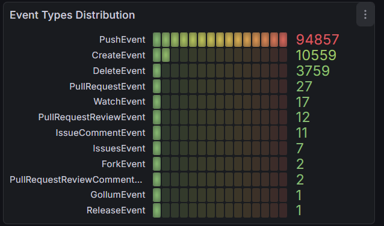
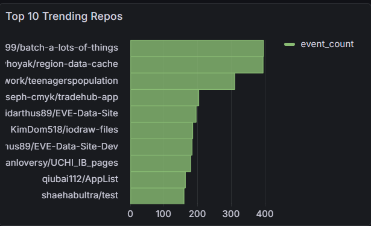

# Real-Time GitHub Analytics Platform

A production-style **real-time data engineering system** that ingests live GitHub public events, processes them using distributed streaming infrastructure, stores both raw and aggregated data, and exposes analytical insights through dashboards.

This project mirrors patterns used in modern data platforms:  
**event streaming → stream processing → analytics storage → visualization**.

📊 Dashboard Highlights
	•	Event Type Distribution (PushEvent, CreateEvent, etc.)
	•	Top 10 Trending Repositories
	•	Most Active GitHub Users
	•	Events Per Minute (Streaming Throughput)
Dashboards update automatically as new events flow through the system.





---

## Architecture Overview

GitHub Public Events API
|
v
Kafka (github_events topic)
|
v
Spark Structured Streaming
|
v
PostgreSQL
├─ github_events_fact        (raw events)
├─ github_events_minute     (events per minute)
├─ github_event_types       (event type counts)
├─ github_repo_activity     (repo leaderboard)
└─ github_actor_activity    (actor leaderboard)
|
v
Grafana (real-time dashboards)

---

## System Components

### 1. Data Ingestion
- A custom **GitHub event producer** continuously polls the GitHub Public Events API.
- Events are serialized as JSON and published to Kafka.

**Kafka Topic**
- `github_events`
- Acts as the system’s durable event log.

---

### 2. Stream Processing (Spark)
- **Spark Structured Streaming** consumes Kafka events.
- Events are parsed, flattened, and enriched.
- Data is written to PostgreSQL using micro-batch processing.

**Raw Event Table**
- `github_events_fact`
- One row per GitHub event
- Preserves Kafka metadata (partition, offset, timestamp)

---

### 3. Aggregations (Spark Batch Jobs)
Separate Spark jobs compute analytical rollups from the raw fact table:

- **Events per minute**
- **Event type distribution**
- **Most active repositories**
- **Most active users**

These aggregations are written to dedicated PostgreSQL tables optimized for dashboard queries.

---

### 4. Storage (PostgreSQL)
PostgreSQL serves as the analytical store:
- Raw events (append-only fact table)
- Pre-aggregated tables for fast dashboard queries

Schema initialization is automated via `db/init.sql` on container startup.

---

### 5. Visualization (Grafana)
Grafana connects directly to PostgreSQL and renders:
- Time-series charts
- Leaderboards
- Real-time activity trends

Dashboards update automatically as new streaming data arrives.

---

## Tech Stack

- **Kafka** – event streaming backbone  
- **Apache Spark 3.5** – distributed stream & batch processing  
- **PostgreSQL 15** – analytical storage  
- **Grafana** – visualization & dashboards  
- **Docker Compose** – local orchestration  

---

## Project Status

**Current Phase: Streaming + Analytics + Visualization (Completed)**

✅ Kafka ingestion working  
✅ Spark Structured Streaming → Postgres  
✅ Aggregation tables populated  
✅ Grafana connected and rendering data  
✅ End-to-end real-time data flow verified  

---

## Running the Project

```bash
docker compose -f docker/docker-compose.yml up -d

Once running:
	•	Kafka ingests GitHub events
	•	Spark streaming job writes raw events
	•	Aggregation jobs populate analytics tables
	•	Grafana is available at http://localhost:3000

Repository Structure

.
├── docker/
│   ├── docker-compose.yml
│   └── Dockerfile
├── ingestion/
│   └── github_producer.py
├── streaming/
│   ├── spark_stream.py
│   └── spark_aggregations.py
├── db/
│   └── init.sql
├── jars/
│   └── kafka + jdbc dependencies
└── README.md

```

## Why This Project Matters

This project demonstrates:
	•	Real-time streaming fundamentals
	•	Distributed data processing with Spark
	•	Event-driven architecture using Kafka
	•	Analytics-ready schema design
	•	Practical dashboarding with Grafana

It intentionally focuses on infrastructure realism, reflecting production data engineering systems rather than toy ETL scripts.


Next Steps (Planned)
	•	Airflow DAGs for scheduled aggregation jobs
	•	Incremental UPSERT patterns for aggregates
	•	Data quality checks and monitoring
	•	Grafana alerting
	•	Cloud deployment (AWS / GCP)
